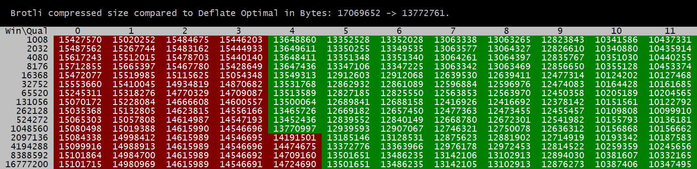
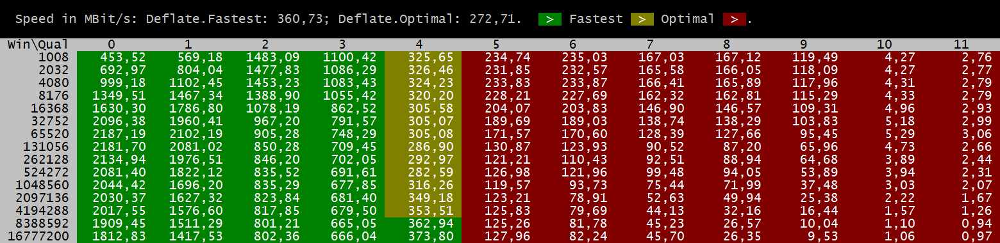
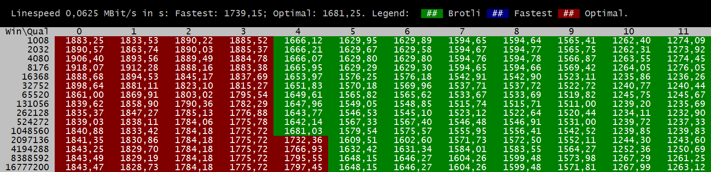
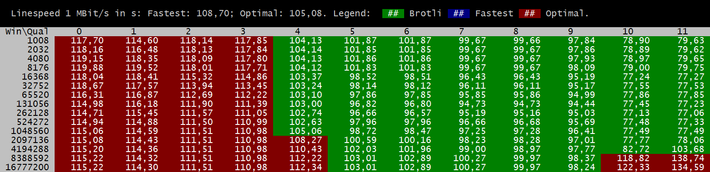
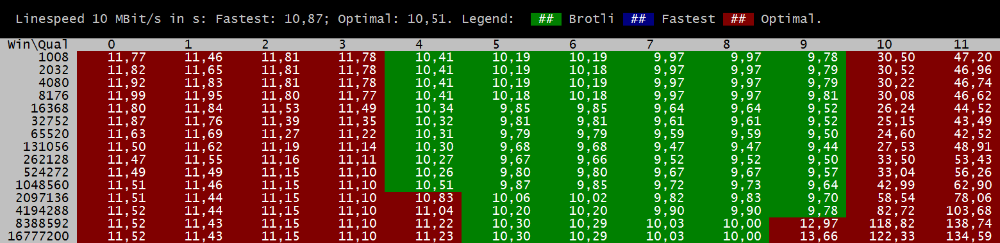
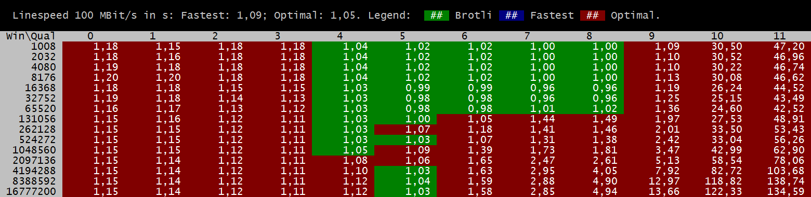
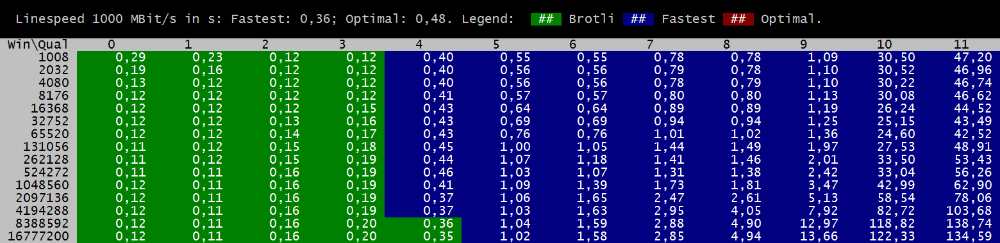
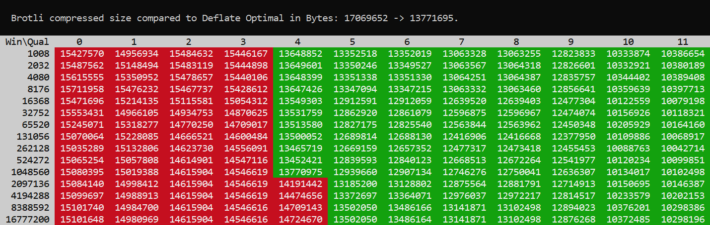
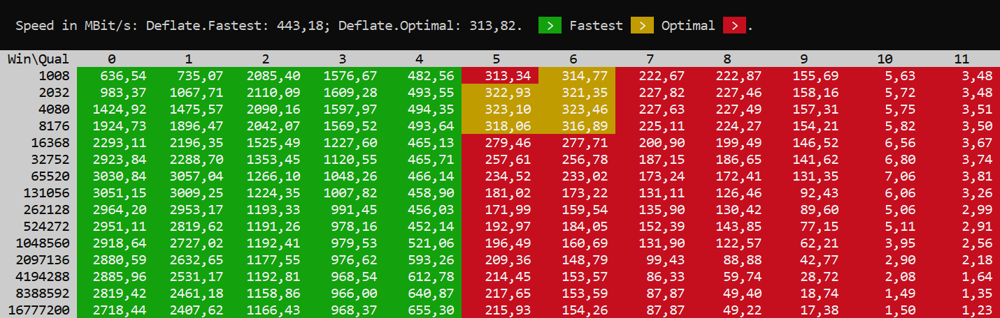

# Performance comparison between Brotli and deflate in .NET.

I had a discussion with a friend of mine. His claim is that deflate should be suited better than Brotli for general purpose data like binary protocols. The main reason for this argument is because deflate doesn't have a global dictionary not matching the test-task. (The predefined dictionary of Brotli is optimized for files found in the web: HTML, CSS, JavaScript.)

**So the question is: Which compression algorithm is better and how can we determine this?**

In a real world application not only the raw compression power should be considered. The question also is how fast those data can be compressed.

Here we see how good which of the compression options of Brotli perform. Green fields are where Brotli performs better than deflate regarding the raw compression power. We see, that Brotli starts to perform better than deflate starting with a quality setting of 4. The value in the cell are the size of the compression result:

When we compare the compression speed, we see that Brotli gets slower than deflate when Brotli performs better regarding the raw performance power:

This indicates that the right choice of the compression algorithm depends strongly on the environment or the regarding task: If you know, you only have a few clients and a slow line speed, you should choose the strongest compression possible. When your application is connected with fast line speeds you may choose a fast compression method or choose to not compress the data at all.

Those are the numbers when transferring the data via an ISDN line. Each number represents the seconds the transfer would take. A red cell indicates that deflate with `Optimal` compression would be the best choice. A blue cell indicates that deflate with `Fastest` compression would be the best choice. A green cell indicates that the corresponding Brotli settings are better than any deflate setting the .NET framework is offering:

Those are the numbers for 1 MBit, 10 MBit and 100 MBit:

Those are the numbers for 1 GBit. Here we see that deflate `Optimal` is never a good choice (for 1 GBit/s):

Sadly, we find no "perfect" choice for all scenarios. And despite all those line speeds we also need to consider memory and cpu consumption. For instance, when we have clients which are only connected via 2 MBit or our application requires only 2 MBit compressed bandwith. Than we may use something with Brotli compression quality of 10 or 11. However this will lead to one core being utilized by 100%. So, if we have more clients than cores the performance would also degrade.

# Performance enhancements in .NET 5.

With .NET 5 the brotli compressor has been enhanced a little more. The compression rate is now better than before:

Also the speed has been increased in relation to deflate with .NET 5:

# Conslusion.

The Brotli implementation has *many* advantages over the deflate implementation in .NET:

* Brotli supports way more options than the `DeflateStream` in .NET.
* Because of those additional options Brotli can be configured to compress data with a rate of 2 GBit/s. Deflate `Fastest` rate is only at 361 MBit/s. In this mode (2 GBit/s) Brotli still decreases the file size of about 12%.
* Brotli is extremely versatile. When an extremely fast compressor is required you can use Brotli instead of adding another library which supports lz4 or something like that.
* When required Brotli can also be used as compressor for files. With enough time Brotli always outperforms deflate regarding compression size.

Wishes for future .NET frameworks:

* Also implement deflate like `BrotliEncoder` with all relevant deflate options.
* Add the ability to load a custom predefined dictionary to the `BrotliEncoder` and `BrotliDecoder`.

The test data used here are a test TIFF image from the internet, upscaled by 200% and saved as an uncompressed TIFF file:

